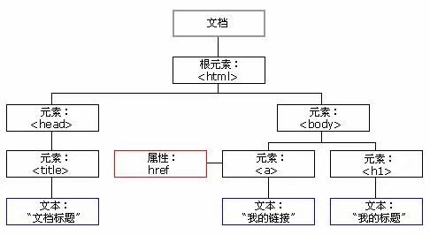

# DOM 对象
## 什么是 DOM 对象
 - DOM 对象是文档对象模型，在网页被加载时，浏览器会创建页面的文档对象模型（Document Object Model）。
 - HTML DOM 模型被构造为对象的树：



## DOM对象的作用
 - 通过可编程的对象模型，JavaScript 获得了足够的能力来创建动态的 HTML。
 - JavaScript 能够改变页面中的所有 HTML 元素
 - JavaScript 能够改变页面中的所有 HTML 属性
 - JavaScript 能够改变页面中的所有 CSS 样式
 - JavaScript 能够对页面中的所有事件做出反应


## 查找元素
 - 通常，通过 JavaScript，您需要操作 HTML 元素。
 - 为了做到这件事情，您必须首先找到该元素。有三种方法来做这件事：
 - 通过 id 找到 HTML 元素
 - 通过标签名找到 HTML 元素
 - 通过类名找到 HTML 元素

```
    <div id="div1" class="div2" name="div3">盒子标签</div>
    <script type="text/javascript">
        // 根据id属性获取元素对象
        var id = document.getElementById("div1");
        // 根据class属性获取元素集合
        var className = document.getElementsByClassName("div2")[0];
        // 根据标签名获取元素集合
        var tagName = document.getElementsByTagName("div")[0];
        // 根据name属性获取元素集合
        var name = document.getElementsByName("div3")[0];
    </script>
```

## 案例
 - 全选按钮的实现